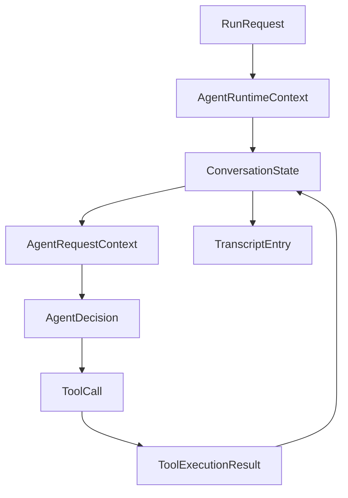
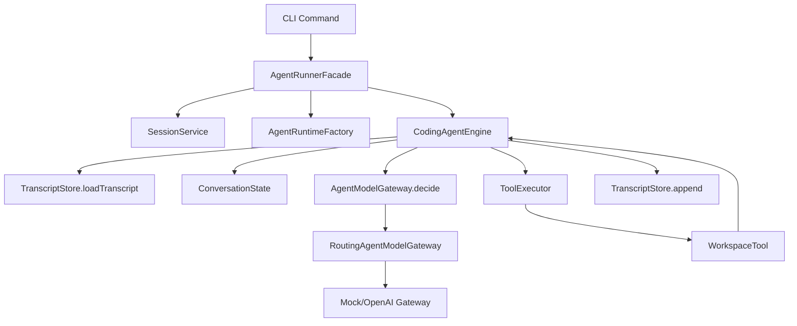

# 架构说明

## 1. 目标

本项目不是按 `MarcelLeon/claude-code` 的文件形态逐个翻译到 Java，而是按其外部行为和核心运行模式做 clean-room 复刻。

这里的“行为等价”指：

- CLI 负责接收任务、恢复会话、装配运行时
- Runtime 负责多轮决策、工具执行、结果回填、收敛结束
- Model Gateway 负责把统一领域模型映射到具体大模型供应商
- Tool Layer 负责在工作区内执行本地能力
- Persistence 负责 transcript 持久化与续跑

## 2. 对齐 Claude Code 的抽象映射

参考 `MarcelLeon/claude-code` 的源码结构，可以把行为上最重要的部分抽象成下表：

| Claude Code 抽象 | Java 当前抽象 |
| --- | --- |
| CLI bootstrap / main entry | `cli` |
| Query engine / agent loop | `runtime` |
| API client / provider routing | `model` |
| tools / tool registry | `tool` |
| transcript / history | `persistence` |
| runtime config / init | `config` + `bootstrap` |

这意味着我们追求的是“模块职责等价”，而不是“文件名等价”。

## 3. 领域模型

当前最核心的领域对象如下：

- `RunRequest`
  - 表示一次 CLI 任务输入
  - 对应外部入口参数，而不是内部推理状态
- `AgentRuntimeContext`
  - 表示一次运行的静态上下文
  - 包括 workspace、provider、model、maxTurns、session 等
- `ConversationState`
  - 表示一次运行内的动态会话状态
  - 持有历史 transcript 和本轮运行产生的工具结果
- `AgentDecision`
  - 表示模型对“下一步动作”的决策
  - 当前只有两种动作：直接回答、调用一个工具
- `ToolCall`
  - 表示一次工具调用请求
- `ToolExecutionResult`
  - 表示工具执行结果
- `TranscriptEntry`
  - 表示持久化会话中的一条记录

这些对象的关系是：

## 4. 核心流程

当前的主流程按 Java 习惯拆成三段：

1. CLI 装配阶段
   - `CodingAgentApplication`
   - `CodingAgentCliCommand`
   - `RootCommand` / `RunCommand` / `ChatCommand` / `DoctorCommand`

2. Runtime 编排阶段
   - `AgentRunnerFacade`
   - `AgentRuntimeFactory`
   - `CodingAgentEngine`

3. Provider / Tool / Persistence 协作阶段
   - `RoutingAgentModelGateway`
   - `WorkspaceTool` + `ToolExecutor`
   - `TranscriptStore`

对应执行流程：

## 5. 模块边界

### `cli`

职责：

- 解析外部命令
- 渲染终端输出
- 收口异常
- 管理交互式 chat 的 slash command 分发

不负责：

- 工具执行细节
- 模型决策逻辑
- transcript 存储细节

### `runtime`

职责：

- 管理一次 run 的生命周期
- 维护多轮 loop
- 组装静态上下文与动态会话状态

不负责：

- 供应商 SDK 细节
- 单个工具的实现细节
- CLI 参数解析

### `model`

职责：

- provider 路由
- prompt 组装
- 结构化决策协议说明、解析与校验

不负责：

- 直接操作工作区文件
- 决定如何落盘 transcript

当前在 Java 实现里，`model` 进一步拆成两层：

- provider gateway
  - 负责请求具体模型供应商
  - 如 `OpenAiAgentModelGateway`
- decision protocol
  - 负责定义“模型该返回什么结构”以及“如何把文本解码成领域对象”
  - 如 `AgentDecisionProtocol` / `JsonAgentDecisionProtocol`

这样做的原因是：

- provider 更换时，不需要复制粘贴 JSON 提取逻辑
- prompt builder 和 response parser 可以围绕同一协议对象协作
- 后续从 JSON 迁移到更强的结构化协议时，影响面更小

### `tool`

职责：

- 实现本地可执行能力
- 保持工作区边界
- 统一返回工具结果

不负责：

- 多轮对话编排
- 模型协议解析

### `persistence`

职责：

- transcript 读写
- 为续跑提供历史记录

不负责：

- 决策下一步动作

## 6. 当前实现原则

为了保持后续可持续迭代，当前实现遵守：

- 不以 TS 文件名或类名为翻译目标
- 优先沉淀 Java 侧稳定的领域模型
- 外部行为尽量向 Claude Code 靠拢
- 内部实现优先遵守 Java/Spring 的模块边界
- 单类尽量控制在 500 行以内

## 7. 下一步演进方向

下一轮继续保持同一原则推进：

- 在现有 `chat` / slash command 模型上继续丰富交互体验
- 把当前 JSON 决策协议升级为更稳的结构化协议
- 把 transcript 续跑从“原始记录回放”提升为更完整的 session runtime
- 为工具权限、流式输出和命令策略增加独立边界
